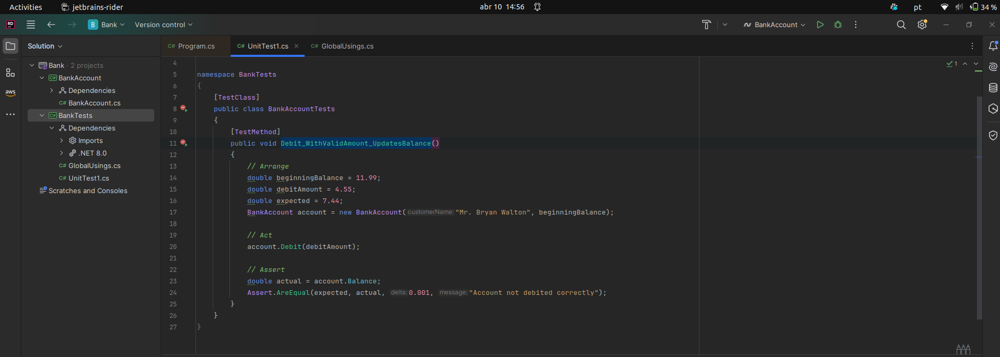
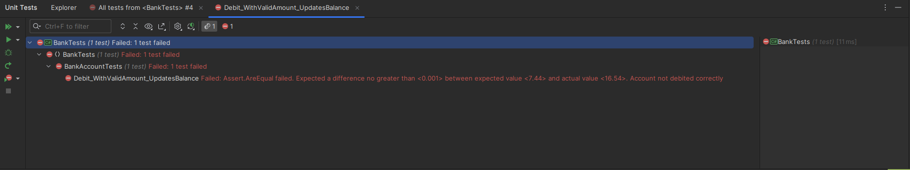
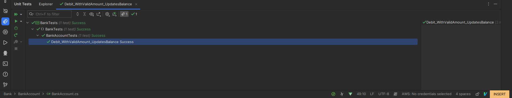
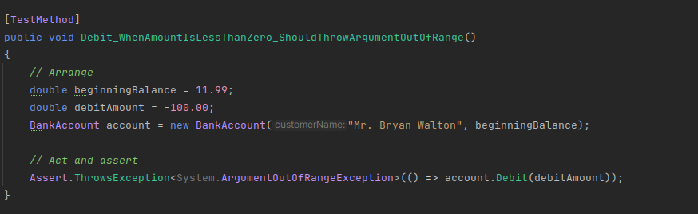
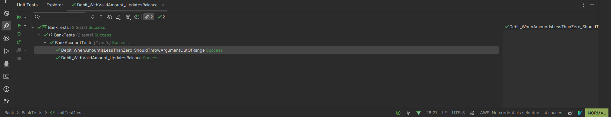
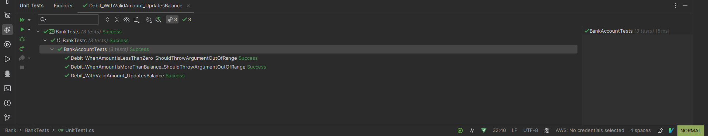

## Criar e executar testes de unidade para código gerenciado"

### Tecnologia Utilizada
- **Linguagem**: C#

É uma linguagem de programação orientada a objetos desenvolvida pela Microsoft. É amplamente utilizada para o desenvolvimento de aplicativos para a plataforma .NET.
- **Ferramentas**: Rider

É um ambiente de desenvolvimento integrado (IDE) desenvolvido pela JetBrains. Oferece uma variedade de ferramentas para desenvolvimento de software, incluindo edição de código, depuração e compilação. É uma alternativa ao Visual Studio para o desenvolvimento em C# e outras linguagens.

- **Frameworks**: MSTest

Ele é um framework de testes de unidade específico para o ambiente .NET. Ele oferece funcionalidades para escrever, organizar e executar testes dentro do Visual Studio. O uso do MSTest facilita a automação de testes e ajuda a manter a qualidade do código ao longo do ciclo de desenvolvimento do software.

### Conceitos Aprendidos
1. **Testes de Unidade**: Testes que verificam o funcionamento correto de partes específicas do código, isoladas de outras partes do sistema. Eles permitem identificar e corrigir problemas no código de forma precoce, antes que se tornem mais difíceis e caros de resolver. Além disso, garantem a estabilidade e confiabilidade do sistema, pois fornecem um conjunto de casos de teste que podem ser executados repetidamente para verificar se as alterações no código introduzem novos bugs.

2. **Asserts**: Declarações usadas em testes de unidade para verificar se um resultado esperado é igual ao resultado real. Eles são fundamentais para verificar se o comportamento do código está de acordo com as expectativas do desenvolvedor. Eles ajudam a validar as suposições sobre o comportamento do código e a detectar falhas durante a execução dos testes.

3. **MSTest**: Framework de testes de unidade para .NET que permite escrever e executar testes de forma integrada com o Visual Studio. Ele oferece uma estrutura organizada e integrada para escrever e executar testes de unidade dentro do ambiente de desenvolvimento. Isso simplifica o processo de teste, permitindo que os desenvolvedores foquem na criação de código de qualidade e na detecção precoce de problemas.


### Passos do Artigo

1. **Criar um projeto para teste**
   - Iniciar um projeto C# no Visual Studio.
   - Definir uma classe `BankAccount` com métodos `Debit` e `Credit`.

2. **Criar um projeto de teste de unidade**
   - Criar um projeto de teste de unidade MSTest para testar a classe `BankAccount`.

3. **Criar a classe de teste**
   - Criar a classe `BankAccountTests` com métodos de teste para os métodos `Debit` e `Credit`.

4. **Criar o primeiro método de teste**
   - Verificar se o método `Debit` subtrai corretamente o valor do débito do saldo da conta.
   - Criar o método `Debit_WithValidAmount_UpdatesBalance` na classe `BankAccountTests`.



O procedimento é direto: primeiramente, ele instancia um novo objeto BankAccount com um saldo inicial e, em seguida, realiza uma retirada de um valor válido. Em seguida, ele utiliza o método Assert.AreEqual para confirmar se o saldo final corresponde ao esperado. Métodos como Assert.AreEqual, Assert.IsTrue e similares são comumente empregados em testes de unidade.



Nesse caso, o teste falhou e para o teste passar é necessario fazer mudanças no código. O código será alterado pois o teste de unidade revelou um bug que quando o app roda o valor do saque é adicionado ao saldo da conta quando deveria ser subtraído.

Antes da mudança:

```
  m_balance += amount;
```

Depois da mudança:

```
  m_balance -= amount;
```

Agora podemos rodar o teste novamente:



   - Definir um saldo inicial, um valor de débito e um saldo esperado.
   - Criar uma instância de `BankAccount` e chamar o método `Debit`.
   - Usar `Assert.AreEqual` para verificar se o saldo final é o esperado.

5. **Continuar a análise**
   - Criar métodos de teste para verificar outros comportamentos do método `Debit`.
   


   - Verificar se o método lança uma exceção quando o valor do débito é maior que o saldo ou menor que zero.

Teste rodando com sucesso:



5. **Refatorar o código em teste**
   - Refatorar o método `Debit` para lançar exceções com mensagens específicas quando necessário.

Antes da refatoração do app:

```
        if (amount > m_balance)
            {
                throw new ArgumentOutOfRangeException("amount");
            }

            if (amount < 0)
            {
                throw new ArgumentOutOfRangeException("amount");
            }
```

Depois da refatoração do app:

```
        public const string DebitAmountExceedsBalanceMessage = "Debit amount exceeds balance";
        public const string DebitAmountLessThanZeroMessage = "Debit amount is less than zero";

        if (amount > m_balance)
            {
                throw new System.ArgumentOutOfRangeException("amount", amount, DebitAmountExceedsBalanceMessage);
            }

            if (amount < 0)
            {
                throw new System.ArgumentOutOfRangeException("amount", amount, DebitAmountLessThanZeroMessage);
            }
```

Refatoração do código:

```
        [TestMethod]
        public void Debit_WhenAmountIsMoreThanBalance_ShouldThrowArgumentOutOfRange()
        {
            // Arrange
            double beginningBalance = 11.99;
            double debitAmount = 20.0;
            BankAccount account = new BankAccount("Mr. Bryan Walton", beginningBalance);
        
            // Act
            try
            {
                account.Debit(debitAmount);
            }
            catch (System.ArgumentOutOfRangeException e)
            {
                // Assert
                StringAssert.Contains(e.Message, BankAccount.DebitAmountExceedsBalanceMessage);
                return;
            }
        
            Assert.Fail("The expected exception was not thrown.");
        }
```

6. **Testar, gravar e analisar novamente**
   - Ajustar os métodos de teste para lidar corretamente com exceções lançadas pelo método `Debit`.
   - Verificar se os testes falham quando esperado e se passam após a correção do código.
  
Evidência todos testes rodando:



### Conclusão
A implementação de testes de unidade para o método `Debit` da classe `BankAccount` resultou em métodos de teste mais robustos e informativos, além de melhorar o código em teste.

Este resumo detalha os passos do artigo, fornecendo uma visão mais específica do processo de criação e execução de testes de unidade para código gerenciado.
